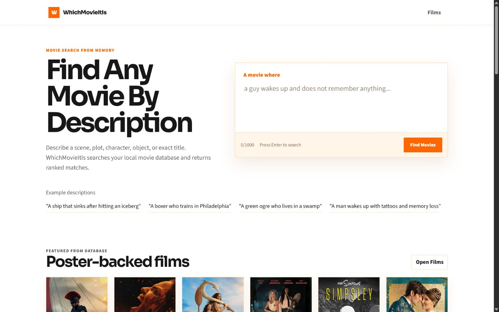
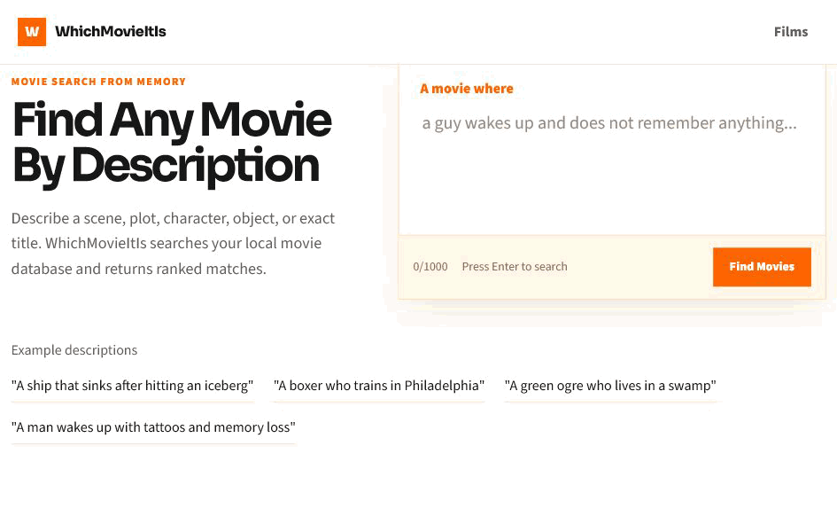
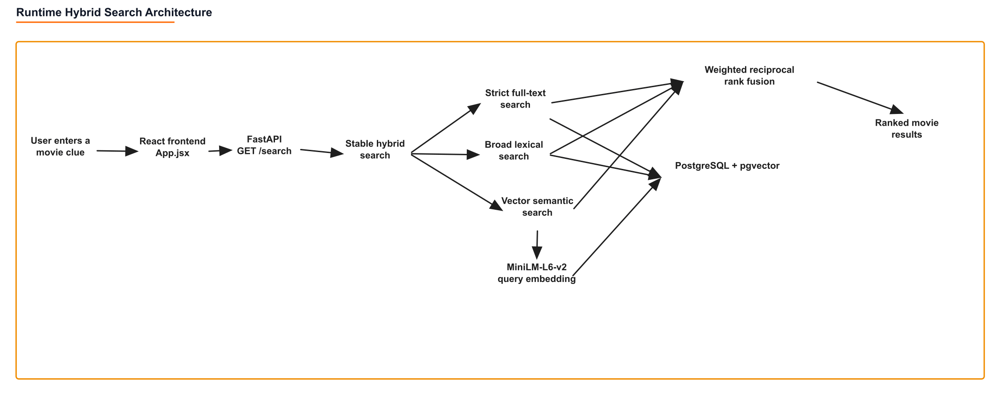
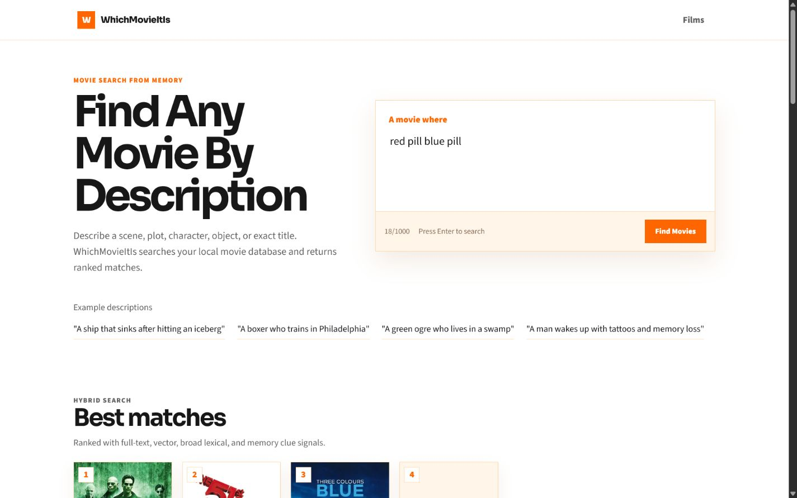
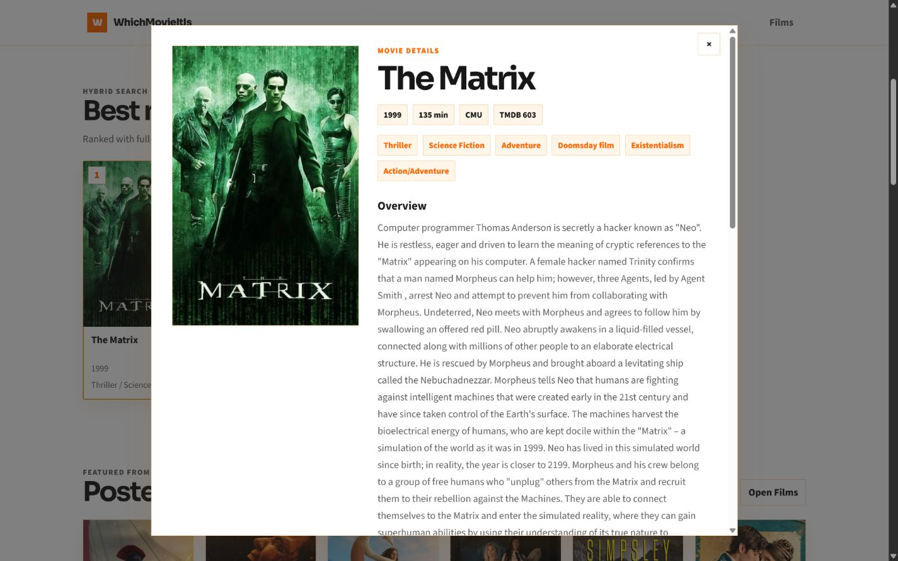
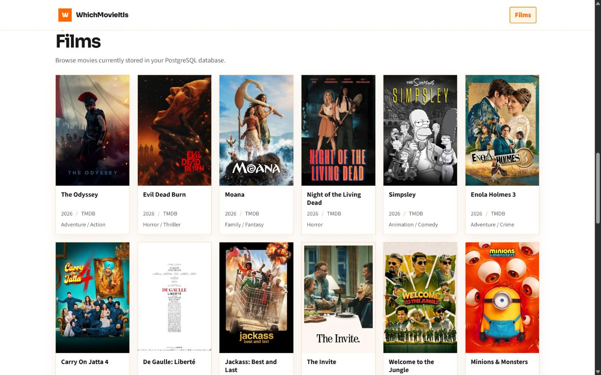
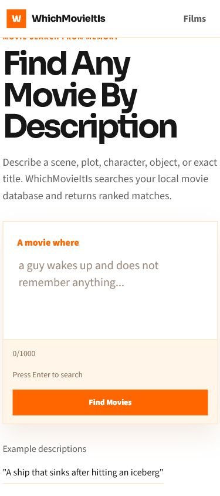

<div align="center">

# WhichMovieItIs

### Find a movie from the scene, plot, object, character, or dialogue you remember.

[](frontend/package.json)
[](requirements.txt)
[](docker-compose.yml)
[](docker-compose.yml)
[](requirements.txt)

**Hybrid movie retrieval over a 42,000+ title catalog, with exact, lexical, and semantic signals fused into one ranked result list.**

</div>



## Product Walkthrough

The user writes a rough memory such as **"red pill blue pill."** The application searches the local catalog, combines multiple retrieval signals, ranks the candidates, and opens a complete movie detail view.



## Why This Project Exists

Traditional title search fails when a person remembers the story but not the name. WhichMovieItIs is built for incomplete human memory:

- a scene: "ship hits iceberg"
- an object: "hockey mask summer camp"
- a character: "archaeologist whip fedora"
- dialogue: "may the force be with you"
- a vague plot: "man wakes up with tattoos and memory loss"
## How Search Works

The public `/search` route uses the stable hybrid pipeline:

1. **Strict full-text retrieval** rewards precise PostgreSQL matches.
2. **Broad lexical retrieval** normalizes individual terms and recovers partial plot matches.
3. **Semantic vector retrieval** embeds the query with `all-MiniLM-L6-v2` and compares it with movie embeddings through pgvector cosine distance.
4. **Weighted reciprocal-rank fusion** merges candidates with the current weights `1.5` strict, `4.0` broad, and `1.25` vector.
5. **A no-result guard** rejects weak vector-only matches.
6. **TMDB title fallback** runs only for title-shaped missing queries, imports the selected movie, embeds it, and searches locally again.



Read the full technical explanation in [`docs/ARCHITECTURE.md`](docs/ARCHITECTURE.md). Editable diagram sources are included beside every exported PNG in [`docs/assets/diagrams`](docs/assets/diagrams).

## Current Quality

Latest validated stable-hybrid evaluation over the repository's 50-query judged test set:

| Metric | Result |
|---|---:|
| Hit@5 | **1.0000** |
| MRR@10 | **0.9285** |
| Recall@10 | **0.9593** |
| NDCG@10 | **0.8859** |
| No-result correctness | **1.0000** |
| Average latency | **406.09 ms** |
| P95 latency | **930.26 ms** |

These numbers measure the maintained evaluation set, not every possible movie-memory query. See [`docs/EVALUATION.md`](docs/EVALUATION.md) for methodology, commands, and limitations.

## Product Surface

<table>
  <tr>
    <td width="50%"></td>
    <td width="50%"></td>
  </tr>
  <tr>
    <td align="center"><strong>Ranked search results</strong></td>
    <td align="center"><strong>Movie details</strong></td>
  </tr>
  <tr>
    <td width="50%"></td>
    <td width="50%"></td>
  </tr>
  <tr>
    <td align="center"><strong>Browseable local catalog</strong></td>
    <td align="center"><strong>Responsive mobile layout</strong></td>
  </tr>
</table>

## Technology

| Layer | Choice | Responsibility |
|---|---|---|
| Frontend | React 19 + Vite 8 | Search UI, catalog browsing, result cards, movie detail modal |
| API | FastAPI + Uvicorn | Validation, catalog endpoints, stable hybrid search orchestration |
| Database | PostgreSQL 17 | Movie metadata, JSON fields, full-text vectors, external IDs |
| Semantic retrieval | pgvector + Sentence Transformers | 384-dimensional embeddings and cosine nearest-neighbor search |
| External catalog | TMDB API/CDN | Posters, metadata enrichment, exact-title runtime fallback |
| Evaluation | Pytest + custom qrels scripts | API tests, retrieval metrics, regression analysis |

## Data Sources

- **CMU Movie Summary Corpus** supplies the base movie metadata, plot summaries, character metadata, and CoreNLP plot artifacts used to build local search documents.
- **TMDB** supplies poster paths, metadata enrichment, and newly requested title imports. Low-information bulk records can be skipped using the minimum-overview filter.

The corpus and database dump are not committed to Git because of size and redistribution constraints. The repository contains the processing, loading, enrichment, embedding, and evaluation code needed to reproduce the system from authorized source data.

## Run Locally

Prerequisites: Docker Desktop, Python 3.10, Node.js, and a TMDB read-access token.

```powershell
git clone <your-repository-url>
cd WhichMovieItIs

python -m venv .venv
.\.venv\Scripts\Activate.ps1
python -m pip install -r requirements.txt

cd frontend
npm.cmd install
cd ..

Copy-Item .env.example .env
# Add TMDB_READ_ACCESS_TOKEN to .env

powershell -ExecutionPolicy Bypass -File .\scripts\start_local.ps1
```

Open `http://127.0.0.1:5173`. The startup script brings up PostgreSQL, FastAPI, and Vite and writes local logs under `.local/`.

```powershell
powershell -ExecutionPolicy Bypass -File .\scripts\stop_local.ps1 -StopDatabase
```

For first-time database construction and corpus commands, follow [`docs/LOCAL_SETUP.md`](docs/LOCAL_SETUP.md).

## Stable API

| Endpoint | Purpose |
|---|---|
| `GET /health` | Backend process health |
| `GET /health/db` | PostgreSQL and pgvector health |
| `GET /search?q=...&limit=5` | Stable hybrid movie search |
| `GET /movies?limit=24&offset=0` | Paginated movie catalog |
| `GET /movies/{movie_key}` | Complete movie detail record |

FastAPI's interactive documentation is available locally at `http://127.0.0.1:8000/docs`.

## Repository Map

```text
backend/app/                 FastAPI routes, schemas, database access
backend/app/services/        Search branches, fusion, catalog, TMDB fallback
backend/tests/               API, search, configuration, and ingestion tests
frontend/src/components/     Modular product UI components
frontend/src/lib/            API and formatting helpers
scripts/                     Data ingestion, embeddings, evaluation, local startup
data/evaluation/             Search queries and graded relevance judgments
evals/                       Generated evaluation and regression reports
docs/                        Architecture, evaluation, setup, and deployment notes
```

## Honest Limitations

- Retrieval quality is measured on a curated 50-query set and needs broader real-user judgments before making universal accuracy claims.
- TMDB runtime fallback is intentionally limited to title-shaped queries; it does not turn arbitrary rough plots into live TMDB searches.
- TMDB overview text is shorter and less descriptive than the CMU plot corpus, so fresh TMDB-only movies may have weaker rough-plot recall.
- The public deployment configuration is prepared, but this README does not claim a live deployment yet.
- The current product is English-first and has no accounts, collections, or personalization.

## Attribution

This product uses the TMDB API and images but is not endorsed or certified by TMDB. Movie metadata and images belong to their respective owners. CMU corpus data remains subject to its original terms.

---

<div align="center">
Built as an end-to-end information-retrieval project: ingestion, indexing, semantic search, ranking, evaluation, APIs, and a polished user interface.
</div>