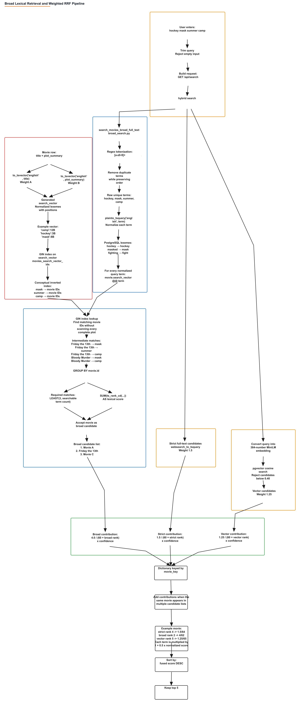
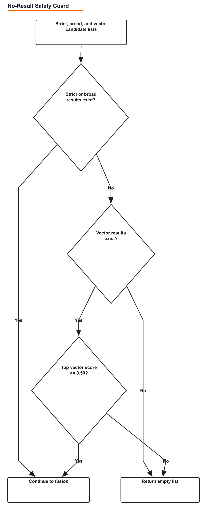

# Architecture

This document describes the code that currently runs in WhichMovieItIs. The production-facing search path is the stable `GET /search` route; experimental comparison routes are not part of this architecture.

## System Boundary

```text
Browser
  -> React + Vite frontend
  -> FastAPI API
  -> hybrid retrieval services
  -> PostgreSQL 17 + pgvector
  -> ranked JSON response
```

TMDB is an external metadata source. It is not queried for every rough-plot search. It is used for catalog enrichment, manual popular/recent/changes imports, and a constrained runtime fallback for missing title-shaped queries.


Editable source: [`runtime-search-architecture.excalidraw`](assets/diagrams/runtime-search-architecture.excalidraw)

## Request Flow

1. `frontend/src/components/HeroSearch.jsx` captures the query.
2. `frontend/src/App.jsx` owns search, catalog, and selected-movie state.
3. `frontend/src/lib/api.js` requests `/api/search` during local development.
4. Vite proxies `/api/*` to FastAPI on `127.0.0.1:8000` and removes the `/api` prefix.
5. `backend/app/main.py` validates `q` and `limit` and calls `search_movies_hybrid()`.
6. The backend returns a Pydantic-validated `MovieSearchResponse`.
7. The frontend renders ranked cards and requests `/movies/{movie_key}` when a card is opened.

The browser never connects directly to PostgreSQL or TMDB.

## Stable Hybrid Retrieval

Implementation: `backend/app/services/hybrid_search.py`.

For a requested result limit, the backend retrieves a larger candidate set:

```text
candidate_limit = clamp(limit x 5, minimum 20, maximum 50)
```

Three corpus-wide retrieval branches run against the local database.

### Strict Full-Text Search

Implementation: `backend/app/services/search.py`.

- PostgreSQL `websearch_to_tsquery('english', query)` interprets ordinary search syntax.
- The stored `movies.search_vector` gives title text weight A and plot text weight B.
- `@@` filters matching rows through the GIN index.
- `ts_rank_cd` provides the branch's raw relevance score.
- This branch is strong for titles, phrases, and direct lexical overlap.

### Broad Lexical Search

Implementation: `backend/app/services/broad_search.py`.

- Regex tokenization keeps `[a-z0-9]+` terms.
- Duplicate tokens are removed while preserving order.
- Each token is normalized through PostgreSQL `plainto_tsquery`.
- Candidate movies must match up to three searchable terms.
- Per-term `ts_rank_cd` values are summed into a broad lexical score.
- The GIN index avoids scanning every complete plot.

This branch recovers queries where the memory uses only a few important words from a longer plot.

### Semantic Vector Search

Implementation: `backend/app/services/vector_search.py` and `backend/app/services/embeddings.py`.

- `sentence-transformers/all-MiniLM-L6-v2` converts the query into a 384-dimensional embedding.
- Movies have precomputed embeddings in `movies.search_embedding`.
- pgvector's `<=>` operator calculates cosine distance.
- The SQL score is `1 - cosine_distance`, so larger values are more similar.
- The HNSW index accelerates approximate nearest-neighbor lookup.
- Vector candidates below `0.40` are excluded before fusion.

The model is preloaded at backend startup by default to avoid a large first-search delay.

### Auxiliary Clue Signal

The current implementation also contains a small curated memory-clue branch in `clue_search.py`. It helps known dialogue, character, and object memories but does not cover the full catalog. The public diagrams focus on the three corpus-wide retrieval branches because those are the scalable core of the system.

## Weighted Reciprocal-Rank Fusion

Each branch result is normalized by that branch's maximum raw score. The current contribution for a movie at rank `r` is:

```text
normalized_score = raw_score / maximum_raw_score
confidence = 1 + 0.5 x normalized_score
contribution = branch_weight / (60 + r) x confidence
```

Current branch weights:

| Branch | Weight |
|---|---:|
| Strict full-text | 1.50 |
| Broad lexical | 4.00 |
| Vector semantic | 1.25 |
| Auxiliary clue | 6.00 |

Candidates are merged by stable `movie_key`. Contributions are added when the same movie appears in multiple lists, then results are sorted by fused score and title.



Editable source: [`hybrid-ranking-pipeline.excalidraw`](assets/diagrams/hybrid-ranking-pipeline.excalidraw)

## No-Result Safety Guard

Vector similarity always returns nearest neighbors, even for nonsense. The guard prevents weak vector-only results:

- If strict or broad lexical candidates exist, continue.
- If no vector candidates exist, return an empty list.
- If only vector candidates exist, require the top score to be at least `0.50`.
- Otherwise return an empty list.



Editable source: [`no-result-guard.excalidraw`](assets/diagrams/no-result-guard.excalidraw)

## Runtime TMDB Fallback

Implementation: `backend/app/services/tmdb_runtime_import.py`.

The fallback is deliberately narrow:

1. Run local hybrid search first.
2. Stop when a local result already has the exact normalized title.
3. Check whether the query looks title-shaped. The heuristic limits length to 80 characters and eight words and gives stronger confidence to title articles and franchise-style markers.
4. Do not call TMDB for ordinary rough-plot queries with usable local results.
5. Acquire a rate-limit slot and query cache entry.
6. Use one shared deadline, configured to three seconds, for TMDB search, detail fetch, database work, and synchronous movie embedding.
7. Fetch movie details with keywords and credits.
8. Upsert the movie, external TMDB ID, poster metadata, search-boost text, and TMDB search documents.
9. Create the movie embedding synchronously so it is immediately searchable.
10. Backfill detailed document embeddings in a background thread.
11. Run local hybrid search again and return the local ranked response.

Defaults from `backend/app/config.py`:

| Control | Value |
|---|---:|
| Runtime timeout | 3 seconds |
| Attempts | 1 |
| Rate limit | 10 requests per 60 seconds |
| Query cache | 1800 seconds |

TMDB is therefore an ingestion fallback, not the primary search engine.

## Data Ingestion

### CMU Corpus

`scripts/build_cmu_processed.py` joins metadata and plot summaries into JSONL. `scripts/load_cmu_movies.py` upserts the base catalog. `scripts/cmu_search_document.py` builds:

- plot-summary documents
- character/cast documents
- CoreNLP plot-signal documents

`scripts/backfill_movie_embeddings.py` creates the embedding used by the stable vector branch. `scripts/backfill_search_document_embeddings.py` supports document-level experiments and future retrieval work.

### TMDB Catalog Growth

`scripts/import_tmdb_movies.py` supports:

- manual TMDB IDs
- popular discovery pages
- recent releases
- daily changes

The default quality gate skips overview text shorter than 80 characters. Import updates existing matched CMU movies instead of replacing their richer CMU plot summary, and inserts a new `tmdb:{id}` movie when no local identity exists.

## Database Model

### `movies`

Primary searchable movie record.

- stable `movie_key`: `cmu:{wikipedia_id}` or `tmdb:{tmdb_id}`
- title, release date, genres, languages, countries, runtime, revenue
- plot summary and source
- TMDB ID and poster path
- `search_boost_text` for keywords, credits, alternate titles, and metadata
- generated PostgreSQL full-text vectors
- 384-dimensional movie embedding

### `movie_external_ids`

Maps a local movie to source-specific identifiers without making a provider ID the application's primary identity.

### `movie_search_documents`

Stores multiple searchable text documents per movie, including CMU plots, CoreNLP signals, character metadata, TMDB overviews, taglines, keywords, and credits.

### `movie_search_document_embeddings`

Stores one 384-dimensional embedding per search document with its model name.

### `movie_memory_clues`

Stores the limited curated clue set used by the auxiliary branch.

## Important Indexes

- unique B-tree index on `movies.movie_key`
- GIN indexes on generated `tsvector` columns
- HNSW cosine index on `movies.search_embedding`
- HNSW cosine index on document embeddings
- unique source/external-ID index for idempotent TMDB upserts

## Reliability and Failure Behavior

- Pydantic response models prevent accidental API-shape drift.
- `/health` checks the process; `/health/db` checks PostgreSQL and reports the pgvector extension version.
- Production settings reject missing database/TMDB configuration, wildcard CORS, and localhost origins.
- Search and fallback latency are logged to the backend console.
- TMDB failures do not destroy the local result list.
- Changed TMDB rows invalidate stale embeddings before regeneration.
- Local startup uses managed PID files and log files under `.local/`.

## Deployment State

The repository contains a Vercel-compatible frontend/backend configuration and a compact production-database export path. Public deployment is not claimed yet. The current verified product runs locally; deployment instructions remain in `docs/DEPLOYMENT_VERCEL_FREE.md`.