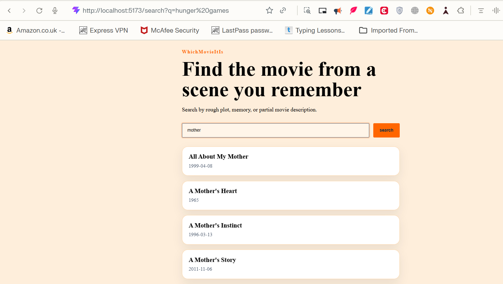

## 25/5/26 
created the folder and files structure
setup git
and all setup of fastapi backend, react frontend and postgresql with pgvector database 

## 26/5/26
implemented backend health endpoint, for fastapi
and database health endpoint with pydantic, psycopg

learn the database connetion in postgresql with docker with fastapi

## 28-29/5/26
output in cmu inspection, 

movie metadata rows:81741
plot summary rows: 42306
coreNlp files:42306

movie metadata inspection
{'rows': 81741, 'unique_wikipedia_ids': 81741, 'column_counts': {9: 81741}, 'missing_fields': {'box_office_revenue': 73340, 'runtime': 20450, 'release_date': 6902}}

- join the data

join inspection
joined ids: 42207
plot ids without metadata: 99
metadata ids without plot: 39534
first unmatched plot ids: ['10083650', '10153756', '10873999', '12651534', '13255982', '133671', '14481527', '14851642', '16758721', '16803295']

- cmu_data_processing
metadata records loaded: 81741
metadata path exits: True
plot path exits: True
limit: 500
output: data\processed\cmu_movies_sample.jsonl

- join cmu metadata with plots for processing
metadata records loaded: 81741
plot record loaded: 42306
joined records: 42207

- filter cmu movie for english sample

records built: 500
first title: The Hunger Games

## 30/5/26
- make sure that all ports and password are consistent
- created movie table
movies table ready
- loaded cmu sample data into database
movies loaded: 500
- added basic movie database search on sample
(.venv) D:\WhichMovieItIs> python.exe -c "from backend.app.services.search import search_movies; print([m['title'] for m in search_movies('Hunger Games', 3)])"
['The Hunger Games']
- added the search (/search) api endpoint

## 1/6/26
- make the frontend 
- connected the search api to the frontend
()

- loaded full 42k+ movies in database
records written: 42207
output: data\processed\cmu_movies_full.jsonl
metadata records loaded: 81741
metadata path exits: True
plot path exits: True
limit: 0
output: data\processed\cmu_movies_full.jsonl

metadata records loaded: 81741
plot record loaded: 42306
joined records: 42207

records built: 42207
first title: Taxi Blues

- verified the search still work

## 2/6/26
- implemented the full-text search 
- added genrated search_vector column with weight title and plot summay
- gin index for faster text search
- output:

love => [('Bodyguard', 14.400001), ('God of Love', 12.2), ('Orange', 6.8), ('Pyaar Ishq Aur Mohabbat', 6.8), ('Kadhir', 6.4), ('Mohabbatein', 6.0), ('Moulin Rouge!', 6.0), ('Saawariya', 6.0), ('Save The Last Dance for Me', 6.0), ('Summer Wars', 6.0), ('When in Rome', 6.0), ('All About Love', 5.8), ('Love Actually', 5.8), ('Cyrano de Bergerac', 5.6), ('Down with Love', 5.4), ('Albela', 5.2), ('Dil To Pagal Hai', 5.2), ('Kurt & Courtney', 5.2), ('Pasión de gavilanes', 5.2), ('Super Star', 5.2)]
war => [('Oh! What a Lovely War', 5.0), ('Breaker Morant', 4.8), ("The War You Don't See", 4.6), ('Born on the Fourth of July', 4.4), ('North and South', 4.4), ('The Life and Death of Colonel Blimp', 4.4), ('Hiroshima', 4.0), ('InuYasha the Movie: Fire on the Mystic Island', 4.0), ('The Weight of Chains', 4.0), ('Prelude to War', 3.8), ('Robot Chicken: Star Wars Episode II', 3.8), ('War Horse', 3.8), ('Birthday Boy', 3.6), ('Einstein and Eddington', 3.6), ('Iluminados Por El Fuego', 3.6), ('Mother Night', 3.6), ('The Young Lions', 3.6), ('Week-End at the Waldorf', 3.6), ('American Drug War: The Last White Hope', 3.4), ('Babylon 5: In the Beginning', 3.2)]
lightsaber => [('The Formula', 3.2), ('LEGO Star Wars: Revenge of the Brick', 1.6), ('Star Wars Episode III: Revenge of the Sith', 1.2), ('Duality', 0.8), ('Starcrash', 0.8), ('Star Wars Episode IV: A New Hope', 0.8), ('Star Wars Episode V: The Empire Strikes Back', 0.8), ('Star Wars: The Clone Wars', 0.8), ('Hardware Wars', 0.4), ('Keroro Gunso the Super Movie 3: Keroro vs. Keroro Great Sky Duel', 0.4), ('Lego Star Wars: The Quest for R2-D2', 0.4), ('Leprechaun 4: In Space', 0.4), ('Robot Chicken: Star Wars Episode II', 0.4), ('Something, Something, Something Dark Side', 0.4), ('Star Wars Episode II: Attack of the Clones', 0.4), ('Star Wars Episode I: The Phantom Menace', 0.4), ('Star Wars Episode VI: Return of the Jedi', 0.4)]
hunger games => [('The Hunger Games: Catching Fire', 2.375), ('The Hunger Games', 1.815271), ('Iluminados Por El Fuego', 0.008696), ('The Aqua Teen Hunger Force Movie Film for Theatres', 0.004938), ('Resurrection of the Little Match Girl', 0.004444), ('Darling', 0.00396), ('Winnie the Pooh and a Day for Eeyore', 0.003618), ('Kaal', 0.002128), ('Crusade in Jeans', 0.00113), ('Shorts', 0.000881)]
zzzxxy => []

- added search evaluation scripts
